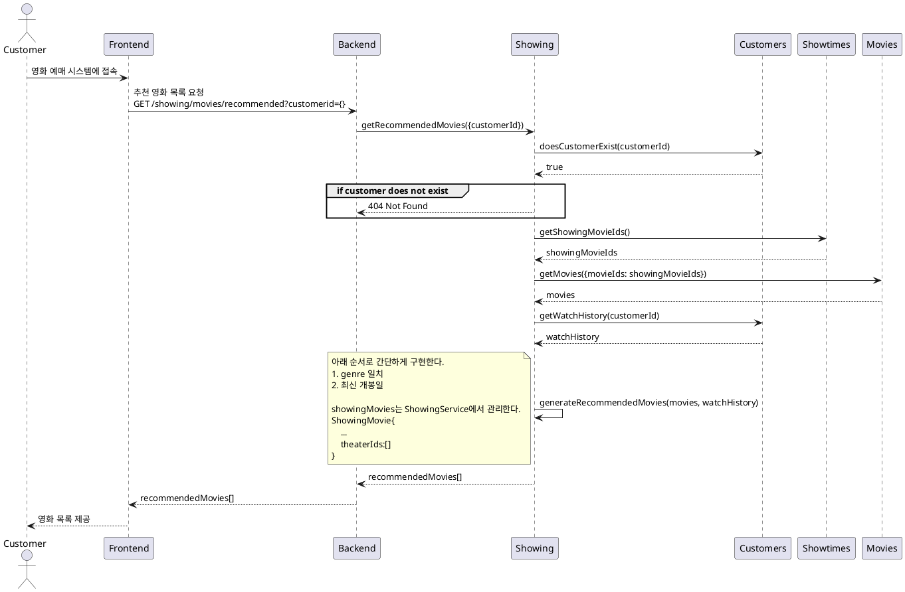
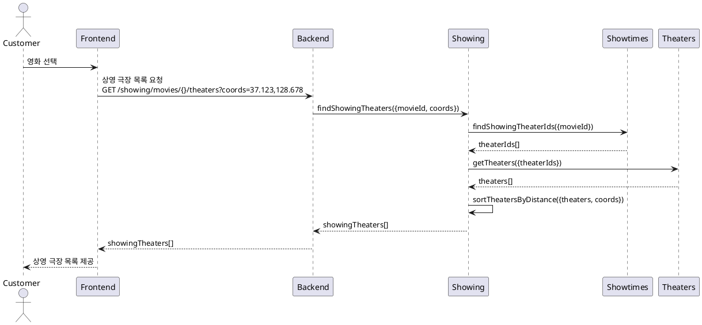
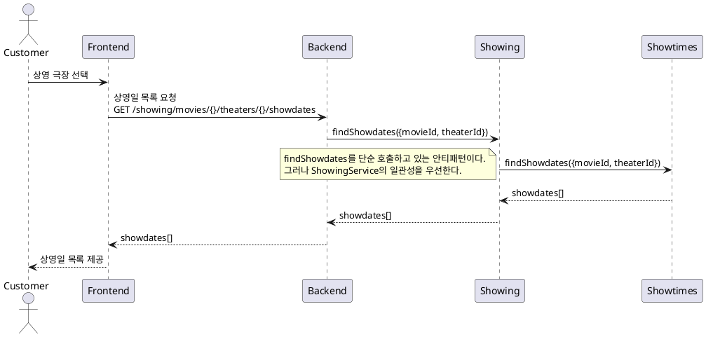
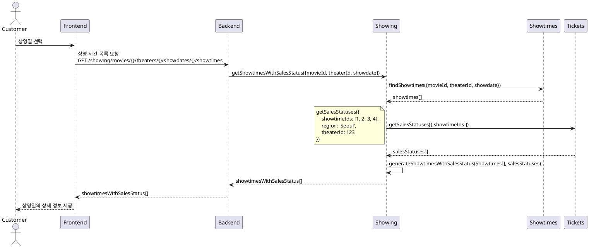
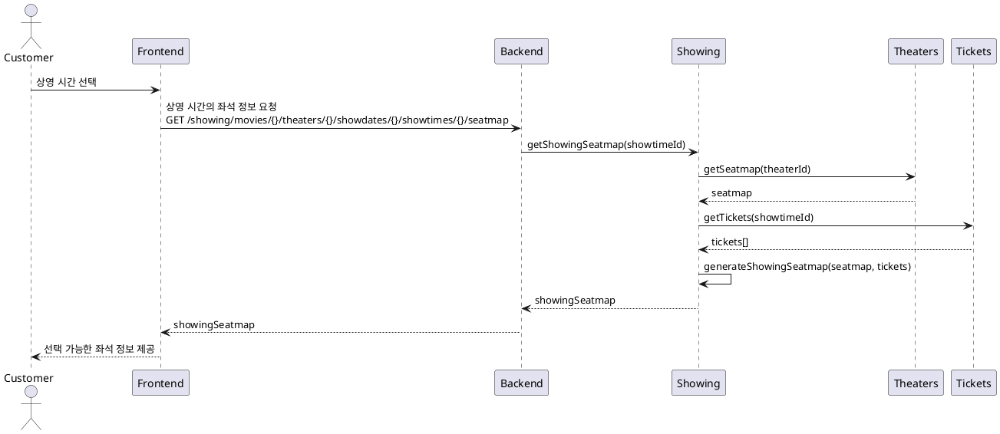
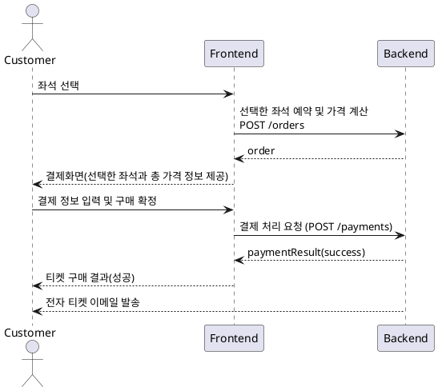
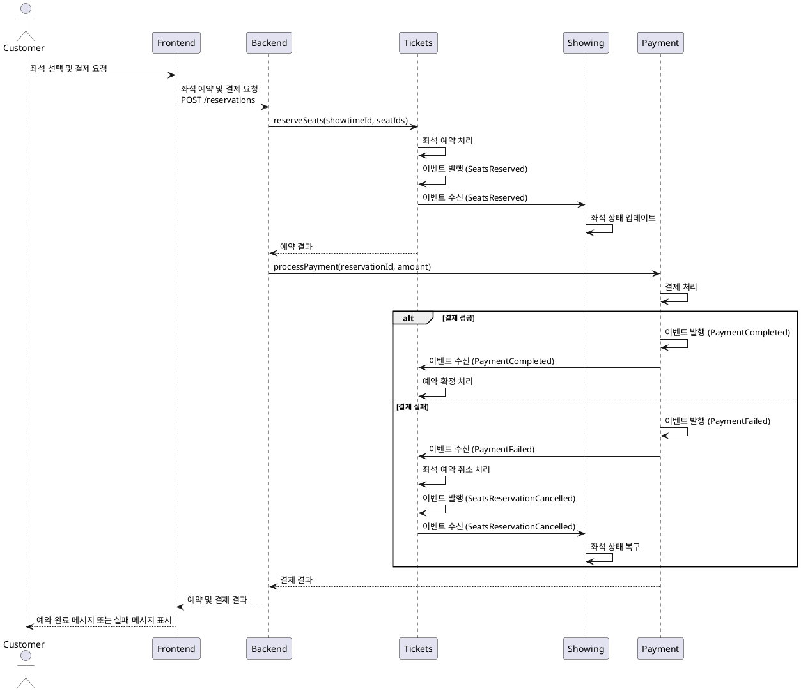

# 티켓 구매 프로세스

### 유스케이스 명: 티켓 구매 (Buy Tickets)

**선행 조건**:

-   고객이 시스템에 로그인되어 있어야 한다.
-   원하는 영화와 극장의 상영 시간 및 좌석이 사용 가능해야 한다.

**기본 흐름**:

1. 고객은 극장 예매 시스템에 접속한다.
1. 시스템은 주간 인기, 월간 인기, 최신 순서로 정렬된 영화 목록을 제공한다.
1. 고객은 영화 목록에서 원하는 영화를 선택한다.
1. 시스템은 영화를 상영하는 극장 목록을 제공한다.
    - 사용자의 현재 위치를 기반으로 반경 5km의 가까운 극장을 추천
    - 특정 지역을 선택하여 해당 지역의 극장 목록을 제공
    - 없으면 가장 가까운 극장 5개
1. 고객은 상영하는 극장을 선택한다.
1. 시스템은 선택된 극장에서 영화 상영일 목록을 제공한다.
1. 고객은 원하는 상영일을 선택한다.
1. 시스템은 선택한 상영일의 상세 정보를 제공한다.
    - 상영 시간 별 남은 좌석수를 포함해야 한다.
1. 고객은 원하는 상영 시간을 선택한다.
1. 시스템은 해당 상영의 선택이 가능한 좌석을 보여준다.
    - 좌석은 로얄석, 커플석 등 등급이 있다.
    - 좌석은 층,블록,열,좌석번호로 지정된다.
1. 고객은 하나 이상의 좌석을 선택한다.
    - 선택한 좌석은 10분간 선점된다.
1. 시스템은 선택한 좌석과 총 가격을 요약하여 보여준다.
1. 고객은 결제 정보를 입력하고 구매를 확정한다.
1. 시스템은 결제를 처리하고, 티켓 구매 성공 메시지와 함께 전자 티켓을 제공한다.

**대안 흐름**:

-   A1. 원하는 상영 시간이나 좌석이 사용 불가능한 경우:
    -   시스템은 사용 불가능한 메시지를 표시하고, 다른 상영 시간이나 좌석을 선택하도록 유도한다.
-   A2. 결제가 실패한 경우:
    -   시스템은 결제 실패 메시지를 표시하고, 결제 정보를 재입력하거나 다른 결제 방법을 선택하도록 유도한다.

**후행 조건**:

-   고객은 구매한 티켓에 대한 전자 티켓을 이메일로 받는다.
-   시스템은 구매된 티켓의 좌석을 사용 불가능으로 업데이트한다.

**특별 요구 사항**:

-   시스템은 결제 처리를 위해 외부 결제 게이트웨이(PaymentGateway)와 통신해야 한다.
-   시스템은 고객이 선택한 좌석이 동시에 다른 고객에게 판매되지 않도록 동시성 관리를 해야 한다.
-   모든 통신은 보안 프로토콜을 통해 이루어져야 한다.

**비즈니스 규칙**:

-   고객은 한 번에 최대 10장의 티켓을 구매할 수 있다.
-   상영 30분 전까지만 온라인으로 티켓을 구매할 수 있다.

