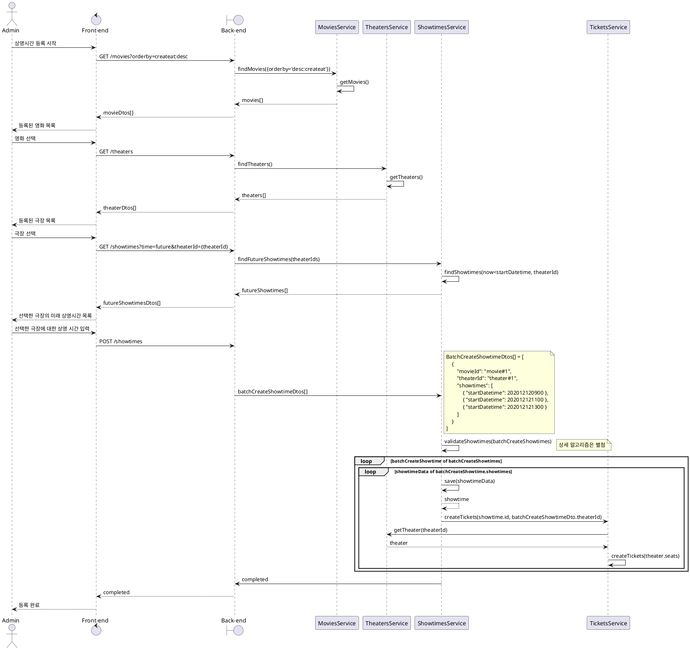
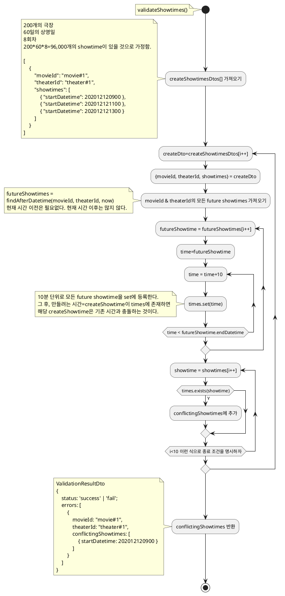

# Create Showtimes

goal : 하나의 영화를 여러 극장에 상영 시간 등록하기

description : 이 유스케이스는 하나의 영화에 대해 여러 극장에 상영 시간을 등록하는 기능을 설명합니다.

actor: admin

preconditions :

-   관리자는 시스템에 로그인해야 합니다.
-   영화와 극장은 이미 시스템에 등록되어 있어야 합니다.

trigger:

-   관리자가 영화 상영 시간 등록 페이지를 방문합니다.

main flow :

1. 시스템은 현재 등록된 영화 목록을 보여줍니다.
1. 관리자는 상영 시간을 등록하려는 영화를 선택합니다.
1. 시스템은 현재 등록된 극장 목록을 보여줍니다.
1. 관리자는 상영 시간을 등록하려는 극장들을 선택합니다.
1. 관리자는 각 극장에 대한 상영 시간을 입력합니다.
1. 관리자는 상영 시간을 등록합니다.
1. 시스템은 등록한 상영 시간이 기존의 상영 시간과 겹치는지 검사합니다.
1. 만약 겹치지 않는다면, 시스템은 상영 시간을 등록하고, 상영 시간 등록이 완료되었다는 메시지를 보여줍니다.

Exception Flow :

-   만약 상영 시간이 기존의 상영 시간과 겹친다면
    1. 시스템은 상영 시간 등록에 실패했다는 메시지와 함께 어떤 상영 시간이 겹쳤는지 정보를 보여줍니다.
    1. 기본 흐름 5단계로 돌아갑니다.

Postconditions :

-   선택한 극장에서 선택한 영화의 상영 시간이 성공적으로 등록되어야 합니다.
-   데이터베이스에 등록한 상영 시간 정보가 반영되어야 합니다.
-   상영시간에 해당하는 티켓이 생성되어야 한다.

## 상영 시간 충돌 검증 알고리즘 컨셉

상영 시간은 최소 10분 단위다.

기존에 등록되어 있던 showtime[]을 set<number>로 등록한다.

예를 들어 2023/12/31 09:00 - 10:40이면

202312310900,202312310910,202312310920 이렇게 등록한다.

그러면 바로 비교 가능하다.

## 시퀀스

